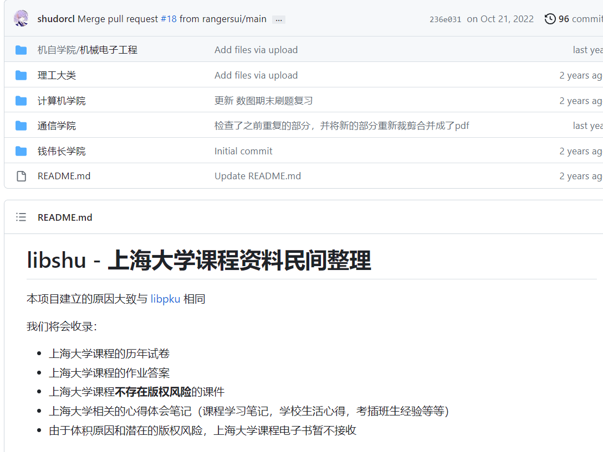

# 🖥️[SHU-CS-Source-Share](https://github.com/1051727403/SHU-CS-Source-Share)

## [❤️](https://github.com/makeplane/plane#️-community)SHU-上大计算机资料分享汇总

注：本项目旨在通过汇总学习资料的方式帮助上大计算机同学更好地进行学习，无任何不良引导。

资料来源：学长学姐分享以及网络上搜索

所有资料地址均经过鉴定，为免费资源，质量有保障，部分敏感资源没有。

**PS:若想要的资料不在项目内，也可以私信我，我会尽量去完善(\*\^▽\^\*)**

# 🔥资料地址汇总(不包括电子书)

电子书可以直接在本项目中找到，资料地址一般是实验、报告、PPT、复习资料等类型的

-------------------分割线-------------------

#### 🎉最新更新时间：2023-9-21

#### 👉最新更新内容：新增C语言、线性代数、数据分析与智能计算、大物实验、删除部分敏感资源

🤗PS：感谢同学分享！

-------------------分割线-------------------

### SHU-数据结构资料

1、[数据结构（2）课件PPT](https://github.com/1051727403/SHU-CS-Source-Share/tree/main/%E5%AD%A6%E4%B9%A0%E8%B5%84%E6%96%99%EF%BC%88%E9%9D%9E%E7%94%B5%E5%AD%90%E4%B9%A6%EF%BC%89/%E6%95%B0%E6%8D%AE%E7%BB%93%E6%9E%84/%E6%95%B0%E6%8D%AE%E7%BB%93%E6%9E%84%EF%BC%882%EF%BC%89/PPT%E8%AF%BE%E4%BB%B6)：本项目学习资料内

### SHU-计算机网络

1、[❤️](https://github.com/makeplane/plane#️-community)[SHU-计网实验分享](https://github.com/1051727403/SHU-NetWork-report)

  

   

### SHU-操作系统

1、[❤️](https://github.com/makeplane/plane#️-community)[SHU-操作系统（1-2）实验全报告](https://github.com/1051727403/SHU-OS-Report)

   

### SHU-计算机组成原理

1、[❤️](https://github.com/makeplane/plane#️-community)[机组原理（1、2）实验报告](https://github.com/1051727403/SHU-CS-Source-Share/tree/main/%E5%AD%A6%E4%B9%A0%E8%B5%84%E6%96%99%EF%BC%88%E9%9D%9E%E7%94%B5%E5%AD%90%E4%B9%A6%EF%BC%89/%E8%AE%A1%E7%AE%97%E6%9C%BA%E7%BB%84%E6%88%90%E5%8E%9F%E7%90%86)：本项目学习资料内

2、[机组原理（1、2）实验指导书等辅助](https://github.com/1051727403/SHU-CS-Source-Share/tree/main/%E5%AD%A6%E4%B9%A0%E8%B5%84%E6%96%99%EF%BC%88%E9%9D%9E%E7%94%B5%E5%AD%90%E4%B9%A6%EF%BC%89/%E8%AE%A1%E7%AE%97%E6%9C%BA%E7%BB%84%E6%88%90%E5%8E%9F%E7%90%86)：本项目学习资料内

   

### SHU-编译原理

1、[❤️](https://github.com/makeplane/plane#️-community)[编译原理考点和概念全集](https://icy-roadway-527.notion.site/96c5082078494e85994fd6c2e05c1893)

  

   

### SHU-计算机体系结构

1、[上海大学计算机体系结构实验四 HPL安装和测试（虚拟机centos7.6环境下保姆级教程！） ](https://blog.csdn.net/qq_51413628/article/details/130628390?spm=1001.2014.3001.5501) 

   

### SHU-数据库

1、[数据库（1）实验](https://github.com/1051727403/SHU-CS-Source-Share/tree/main/%E5%AD%A6%E4%B9%A0%E8%B5%84%E6%96%99%EF%BC%88%E9%9D%9E%E7%94%B5%E5%AD%90%E4%B9%A6%EF%BC%89/%E6%95%B0%E6%8D%AE%E5%BA%93/%E6%95%B0%E6%8D%AE%E5%BA%93%EF%BC%881%EF%BC%89%E5%AE%9E%E9%AA%8C)：本项目学习资料内

2、[数据库（1、2）PPT、教案、复习资料](https://github.com/1051727403/SHU-CS-Source-Share/tree/main/%E5%AD%A6%E4%B9%A0%E8%B5%84%E6%96%99%EF%BC%88%E9%9D%9E%E7%94%B5%E5%AD%90%E4%B9%A6%EF%BC%89/%E6%95%B0%E6%8D%AE%E5%BA%93)：本项目学习资料内

   

### SHU-算法设计与分析课程

1、[❤️](https://github.com/makeplane/plane#️-community)[SHU算法设计与分析课程实验（含代码实现与报告）](https://github.com/RuoShui66/algorithm):罗神出品，品质有保障!

### SHU-数字逻辑

1、[❤️](https://github.com/makeplane/plane#️-community)[数字逻辑全报告和PPT、实验指导书等资料](https://github.com/1051727403/SHU-CS-Source-Share/tree/main/%E5%AD%A6%E4%B9%A0%E8%B5%84%E6%96%99%EF%BC%88%E9%9D%9E%E7%94%B5%E5%AD%90%E4%B9%A6%EF%BC%89/%E6%95%B0%E5%AD%97%E9%80%BB%E8%BE%91):本项目学习资料内

### SHU-软件工程

1、[软件工程复习PPT等资料](https://github.com/1051727403/SHU-CS-Source-Share/tree/main/%E5%AD%A6%E4%B9%A0%E8%B5%84%E6%96%99%EF%BC%88%E9%9D%9E%E7%94%B5%E5%AD%90%E4%B9%A6%EF%BC%89/%E8%BD%AF%E4%BB%B6%E5%B7%A5%E7%A8%8B):本项目学习资料内

### SHU-组合数学

1、[组合数学复习PPT等资料](https://github.com/1051727403/SHU-CS-Source-Share/tree/main/%E5%AD%A6%E4%B9%A0%E8%B5%84%E6%96%99%EF%BC%88%E9%9D%9E%E7%94%B5%E5%AD%90%E4%B9%A6%EF%BC%89/%E7%BB%84%E5%90%88%E6%95%B0%E5%AD%A6):本项目学习资料内

### SHU-C语言

1、[C语言习题、答案等](https://github.com/1051727403/SHU-CS-Source-Share/tree/main/%E5%AD%A6%E4%B9%A0%E8%B5%84%E6%96%99%EF%BC%88%E9%9D%9E%E7%94%B5%E5%AD%90%E4%B9%A6%EF%BC%89/C%E8%AF%AD%E8%A8%80/C%E8%AF%AD%E8%A8%80%E5%A4%8D%E4%B9%A0%E9%A2%98%E5%90%88%E8%BE%91%E5%8C%85):本项目学习资料内

### SHU-线性代数

1、[线性代数PPT、个人笔记、复习资料、历年试卷及答案](https://github.com/1051727403/SHU-CS-Source-Share/tree/main/%E5%AD%A6%E4%B9%A0%E8%B5%84%E6%96%99%EF%BC%88%E9%9D%9E%E7%94%B5%E5%AD%90%E4%B9%A6%EF%BC%89/%E7%BA%BF%E6%80%A7%E4%BB%A3%E6%95%B0):本项目学习资料内

### SHU-数据分析与智能计算

1、[数据分析与智能计算复习资料](https://github.com/1051727403/SHU-CS-Source-Share/tree/main/%E5%AD%A6%E4%B9%A0%E8%B5%84%E6%96%99%EF%BC%88%E9%9D%9E%E7%94%B5%E5%AD%90%E4%B9%A6%EF%BC%89/%E6%95%B0%E6%8D%AE%E5%88%86%E6%9E%90%E4%B8%8E%E6%99%BA%E8%83%BD%E8%AE%A1%E7%AE%97):本项目学习资料内

### SHU-大物实验

1、[大物实验PPT、题库、部分答案参考](https://github.com/1051727403/SHU-CS-Source-Share/tree/main/%E5%AD%A6%E4%B9%A0%E8%B5%84%E6%96%99%EF%BC%88%E9%9D%9E%E7%94%B5%E5%AD%90%E4%B9%A6%EF%BC%89/%E5%A4%A7%E5%AD%A6%E7%89%A9%E7%90%86/%E5%A4%A7%E5%AD%A6%E7%89%A9%E7%90%86%E5%AE%9E%E9%AA%8C):本项目学习资料内

### 🔥SHU-其他（不好分类的）

# 🕵️友情链接

#### 该板块存放其他学长创建的类似资料合集仓库，若本项目内寻找不到想要的资料，可以跳转到其他资料仓库寻找。

-------------------分割线-------------------

**🔥1、[历年试卷、作业答案、心得体会笔记等](https://github.com/shuosc/libshu)**

内容预览如下：

  

**🔥2、[学校课内课程的笔记，电子书，复习资料、包括自己写的一些专业课历年卷的解答等](https://github.com/Amadeus-1048/Course-Review)**

内容预览如下：

  

**🔥3、[上海大学网络空间安全专业指南](https://github.com/shu-cake1salie/SHU-Cyberspace-Security-101)**:主要是网安专业的内容，包括信息安全技术等专业课相关内容

[该项目配套网站](https://shu-cake1salie.github.io/SHU-Cyberspace-Security-101/1_course_computer/08A65001_DB/)：上面项目的成品网站

目前进度信息预览如下：

# 📈贡献者

​    

# 🔔加入我们&分享资料

​	分享内容可以是你的项目地址、博客地址，也可以是一个word文件（我会将其放在本项目的分区内，README中也标识为地址）、PDF、电子书等等

鸣谢：

感谢所有愿意维护该项目以及分享资源的同学，欢迎大家提交PR或是直接QQ联系我，我会及时更新资料。

若想要参与项目维护可以QQ私信我

QQ：1051727403