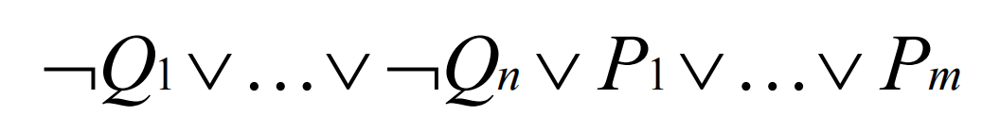
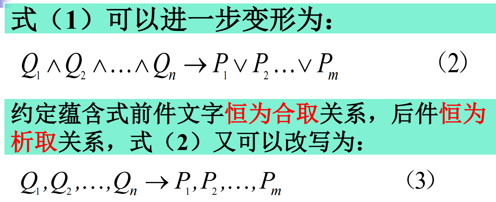
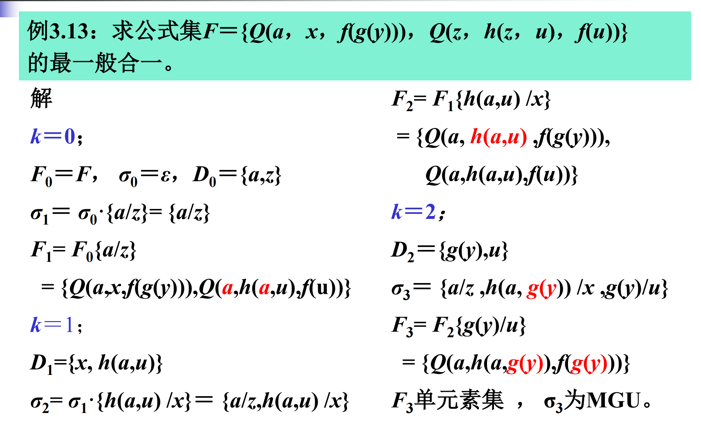
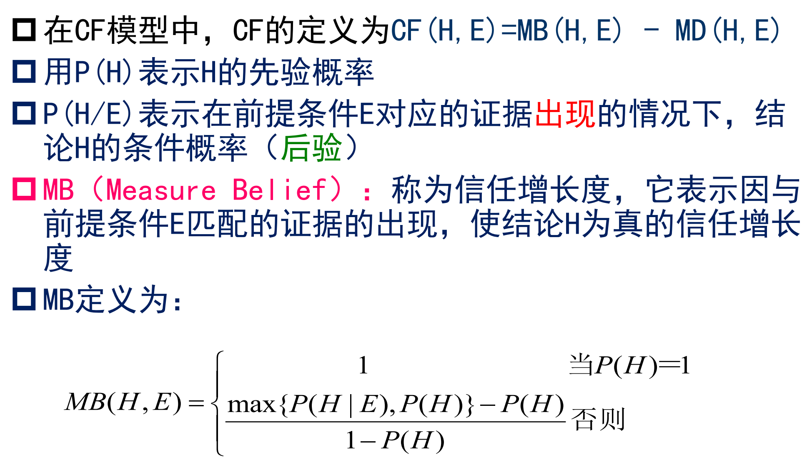
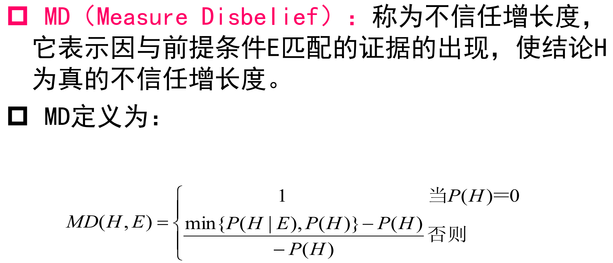
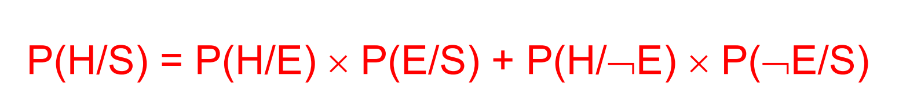
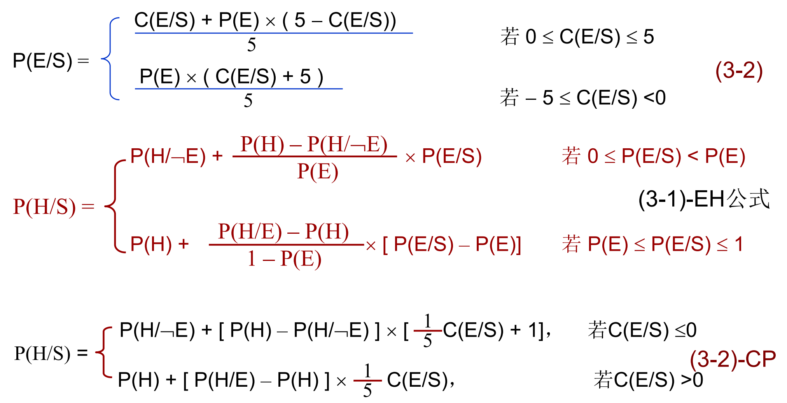

# 基本概念

## 语义角色

* 指有关语言成分在语句所表达的事件中所扮演的参与者角色

* 在自然语言处理中对自然语言进行划分处理称为各个语义角色，其中每个语义角色相互依赖，相互关联

  * 常见的语义角色类型有：施事、受事、与事、工具、方式、时间、处所、结果、目的、原因等

  > 例如对于语句：小明昨天晚上在公园遇到了小红
  >
  > 就可以分为Agent、Time、Location、Predicate、Patient等角色

* 语义角色从一开始的6个扩充到了现在的13个，依据是美国语言学家查理斯·费尔莫尔提出的“格语法”

## 机器学习

* 让计算机能够像人一样自动获取新知识，并且在实践中不断完善自我和增强能力

## 启发函数&估值函数

* 启发函数：对当前结点到大目标结点未来可能需要付出的代价的估计

  对于同一个问题，可能有不同的启发函数，不同的启发函数带来的效果良莠不齐，而各个节点的代价函数是统一确定的，因此选择和优化启发函数是至关重要的

* 估值函数：为了防止在单独利用启发函数的时候误入歧途，会将启发函数和代价函数结合生成估值函数；即初始结点到达结点x处已经付出的==代价==与结点x到达目标结点的==接近程度估计值==的总和

## 语义标注

* 在NLP领域中对于自然语言进行分割，并且对每个部分都判断是什么类型的语义角色

* 语义角色标注是一种浅层的语义分析技术，它只标注谓词（谓语动词、名词、形容词）的语义角色

  > 例如：
  >
  > 昨天张三在家吃苹果。
  >
  > 谓语动词“吃”的语义角色有：施事-张三，受事-苹果，时间-昨天，处所-家

## 博弈树

将双人完备的信息博弈过程用图表示出来，能得到一颗与或树，称为博弈树

* 在博弈树中，下一步该MAX走步的结点称为MAX结点；下一步该MIN走步的结点称为MIN结点
* 博弈树特点：
  * 初始状态为初始结点
  * 博弈树中的或结点和与结点是逐层交替出现的
  * 整个博弈过程都是站在某一方的立场上，所有能使自己获胜的都是本源问题，相应的结点都是可解结点；所有会使对方获胜的结点都是不可解结点

博弈树采用变对子结点进行估值函数计算，再扩展结点的方法，使用的是极大极小化分析，因此引申出了阿尔法-贝塔剪枝

* 阿尔法-贝塔剪枝：
  * 阿尔法剪枝：
    * 对于一个MIN结点，如果能够推导出其上确界b，并且b不大于MIN结点的父节点下确界a（即a >= b），则不必再扩展MIN结点的其他子结点了，剪枝即可
  * 贝塔剪枝：
    * 对于一个MAX结点，如果能够推导出其下确界a，并且a不小于MAX结点的父节点上确界b（即a >= b），则不必再扩展MAX结点的其他子结点了，剪枝即可

## 专家系统

* 专家系统的概念：

  专家系统是一种智能的计算机程序，它运用知识和推理来解决只有专家才能解决的复杂问题

* 专家系统的组成：

  专家----知识库----推理机----系统用户

* 专家系统的特点：

  有专家水平的专业知识、能进行有效的推理、启发性、灵活性、透明性、交互性

  知识库与推理机分离、具有解释功能

* 专家系统的类型：

  * 按照解决类型划分：解释、诊断、预测、设计、规划、控制......
  * 按照应用类型划分：化学、电子学、地质学......
  * 按照系统体系结构划分：集中式、分布式、云计算
  * 按照知识表示形式划分：基于规则、基于一阶谓词、基于框架、基于语义网
  * 按照采用技术划分：符号推断、神经网络

* 专家系统实例：

  * 医学专家系统——MYCIN
    * 系统使用INTER LISP语言编写
    * 推理策略：反向推理、深度优先的搜索
  * 地质勘探专家系统——PROSPECTOR
    * 推理方式：似然推理、逻辑推理、上下文推理

## 希望树

在启发式搜索与或树的过程中，有希望成为最优解树的部分结点所组成的树

* 定义如下：
  * 初始结点S0一定在希望树中
  * 如果结点x在希望树中，则一定有：
    * 如果x是具有子结点的==或结点==，则其==具有最小代价==的子结点一定在希望树中
    * 如果x是具有子结点的==与结点==，则其==全部子结点==都在希望树中

* 与或树的有序搜索过程本质上是寻找希望树的过程，因此随着搜索深度的增加，希望树也会随之变化

## Agent

* Agent的概念：

  一种能够在一定环境中自主运行和自主交互，以满足其设计目标的计算实体

* 按照属性区分Agent：

  * 反应Agent：Agent中包含了感知内外部状态变化的感知器、一组对相关事件作出反应的过程,和一个依据感知器激活某过程执行的控制系统,Agent的活动是由于受到内外部某种"刺激"而发生的
  * 认知Agent：Agent中包含了显式表示的世界符号模型,Agent的决策是通过基于模板匹配和符号操作的逻辑(或准逻辑)推理作出的,如同人们通过"深思熟虑"后作出决定一样
  * 混合Agent：Agent中包含了认知式和反应式两个子系统,通常这两个子系统是分层次的,前者建立在后者的基础之上

* 按照存储方式区分多Agent系统：

  * 反应式多Agent系统：系统由反应式Agent构成，其行为以对环境的感知为基础
  * 黑板模式多Agent系统：系统中的信息均存储在一个称为黑板的存储区内
  * 分布式存储多Agent系统：系统中的Agent通过数据封装拥有自己的私有信息，并且利用消息通信实现不同Agent之间信息交换、知识共享和协作求解

* Agent通信：

  指多Agent系统中不同Agent之间的信息交换，其基本问题包括

  1. 通信方式

     常用的有==消息传送==和==黑板系统==

  2. 通信语言

     常用语言有==知识查询==和==操纵语言KQML==

  3. 对话管理

  4. 通信协议：

     包括底层和高层的协议。底层的有TCP、HTTP、FTP等；高层的有有限状态自动机和Petri网等

* 移动Agent：

  一种可以从网络上一个结点自主移动到另一个结点，实现分布式问题处理的特殊Agent，由移动Agent和移动Agent环境两部分组成

## 决策树

一种由结点和边构成的用来描述分类过程的层次数据结构

一般可以通过：信息增益、增益率、基尼系数等属性来划分

* ID3决策树以==信息增益==来选择划分属性：
  * 熵：$$Entropy(S) = \sum_{i = 1}^{c}{-p_ilog_2p_i}$$，其中S为训练样例集，c为标记值的总数，pi为第i个标记值的样例子集占的比例
  * 如果p=0，则总体为0
  * 信息增益：$$Gain(S,A) = Entropy(S) - \sum_{v \in Values(A)}{\frac{|S_v|}{|S|}Entropy(S_v)}$$，其中S为训练样例集，A为某个属性，Sv为属性A取值为v的样例集

## Horn子句及其类型

* 原子公式以及其否定被称为文字，前者为正文字，后者为负文字；一条子句包含若干正文字和若干负文字；因此可将字句的一般形式表示为：

  

  

  

  

* 至多含有一个正文字（即箭头左侧至多只有一个子句）的子句被称为Horn子句，一共有三种Horn子句的形式：

  

* 可以使用Horn子句进行推理的归结，由此衍生出了Prolog语言

# 基本问题

## 人工智能的主要内容有哪些？

* 机器学习：让机器从数据中学习并不断优化自己
* 自然语言处理：让机器能够理解、分析、生成自然语言
* 计算机视觉：让机器能够感知、理解和识别图像和视频信息
* 机器人学：让机器能够感知环境并且执行任务，包括物理机器人和虚拟机器人
* 智能决策：通关算法和数据分析让机器能够作出可靠的决策
* 人工智能伦理：讨论人工智能应用过程中的伦理问题和社会影响

## 什么是A算法和A*算法

不管是A算法还是A*算法，都使用了相似的算法思路，即：根据启发函数的值来选择下一步搜索的目标

* A算法：

  估值函数如下：$$估值函数f(x) = 代价函数g(x) + 启发函数h(x)$$

* A*算法：

  在A算法的基础上，对启发函数做了进一步的限制：==对所有的结点x均有h(x) <= h*(x)==，其中h*(x)是从结点x到目标结点的实际的最小代价

  > 显然，如果我们始终让h(x)=0，那么一定能够满足h(x) <= h*(x)，然而这样做效率会大大降低，不符合A\*算法的初衷，因此在实际应用中，定义的h(x)应当尽可能大，使其接近h\*(x)

## 全局择优搜索、局部择优搜索

* 全局择优搜索：

  每当需要扩展结点的时候，总是从Open表中的所有结点选取一个估值函数最小的结点进行扩展

* 局部择优搜索：

  每当需要扩展结点的时候，总是从刚生成的子结点中选择一个估值函数最小的结点进行扩展

## 替换与合一的含义

* 替换：
  * 一个替换是形如{t1/x1, t2/x2 ... , tn/xn}的有限集合，其中ti是项，称为替换的分子；xi是互不相同的个体变元，称为替换的分母
  * ti和xi不同，xi不循环出现在tj中
  * ti/xi表示用ti替换xi
  * 若其中ti是不含变元的项，则该替换为基替换
  * 没有元素的替换称为空替换
* 合一：
  * 设有一个公式集F={F1,F2,F3 ... FN}，若存在一个替换Ω，使得F1Ω=F2Ω= ... = FNΩ，则称Ω为F的一个合一，称F为可合一的

## 简述正向推理和反向推理的过程

* 正向推理：
  1. 把用户提供的初始证据放入综合数据库
  2. 检查综合数据库中是否包含问题的解，若已包含，则求解结束，并成功退出；否则进入下一步
  3. 检查知识库中是否有可用的知识，若有，则形成当前可用的知识集，执行下一步；否则转第5步
  4. 按照某种冲突消解策略，从当前可用知识集中选出一条规则进行推理，并将推出的新事实加入综合数据库中，然后转2
  5. 询问用户是否可以进一步补充新的事实，若可以补充，则将补充的新事实加入综合数据库，然后转3；否则表示无解，失败退出

简单来说就是（证据 -> 结论）的流程

* 反向推理：
  1. 将要求证的目标（称为假设）构成一个假设集
  2. 从假设集中选出一个假设，检查该假设是否在综合数据库中，若在，则该假设成立，此时，若假设集为空，则成功退出，否则仍执行第2步；若该假设不在数据库中，则执行下一步
  3. 检查该假设是否可以由知识库的某个知识导出，若不能，则询问用户该假设是否为可由用户证实的原始事实，若是，假设成立，将其放入综合数据库，再重新寻找新的假设，若不是，则转5；若能由某个知识导出，则执行下一步
  4. 将知识库中可以导出该假设的所有知识构成一个可用知识集
  5. 检查可用知识集是否为空，若是，则失败退出；否则执行下一步
  6. 按冲突消解策略从可用知识集中取出一个知识，继续
  7. 将该知识的前提中的每个子条件都作为新的假设放入假设集，然后转2

## Agent的基本特征

* 自主性、反应性、协调性、社会性、推理性、个性、移动性

## 机器学习（形式定义）

* 让计算机能够像人一样自动获取新知识，并且在实践中不断完善自我和增强能力

## 图灵测试、中文屋子

* 图灵测试：
  * 一位测试主持+两位被测对象
  * 被测对象：人、机器
  * 隔离：通过计算机终端通信
  * 被测对象回答具有智能性的问题
  * 如果主持人分辨出人和机器的概率小于50%（30%），则通过图灵测试
* 中文屋子（模拟图灵测试）：
  * 一个人（扮演计算机的CPU）在一个封闭的房子里，有输入和输出与外部相通
  * 输入的问题是中文的，但此人不懂中文；而屋子里有一本英语的指令手册（相当于程序），从中可以找到对应的规则
  * 他按照规则办事，并且将结果写成中文进行输出，看上去就好像他懂中文一样

中文屋子是用来反驳图灵测试对于强人工智能的定义的

## 基于词和基于字的分词方法

汉语自动分词方法

* 基于字的分词方法：

  * 将分词转化为给字贴标签，形式化为机器学习中的序列标记问题

  * 根据字在词中的位置一般有四个标记：词首B、词中M、词尾E、独立成词S

    > 例如下列句子：
    >
    > 自然语言处理是人工智能的分支学科
    >
    > 在每一个字后面都加上标记后的序列如下：
    >
    > 自/B 然/M 语/M 言/M 处/M 理/E 是/S 人/B 工/M 智/M 能/E 的/S 分/B 支/E 学/B 科/E

    对每一句句子加完标签后重新扫描，就可以获得词的序列了

* 基于词的分词方法：

  采用正向最大匹配法：遍历词典中有的词，并且去长度最大的进行分割

# 其他方法论

## 求最一般合一（MGU）

## 可信度方法（C-F模型）

* 公式如下：

  

  

  其中MB表示信任增长度，MD表示不信任增长度，两者的绝对值相等

* 其中由于CF值会有复数个前提条件，因此对于重复结论的CF值的计算如下：

  

## 主观Bayes方法

在很多时候同一个事件的结果对应的前提条件是没有可复制性的，此时P（A｜B）就是一个不必要的概率，在主观bayes方法中将其解释为：在证据B的基础上，假设A的似然性

* 几率函数：$$O(x) = \frac{P(x)}{1 - P(x)}$$

  反过来也可以用已知的几率推出似然性：$$P(x) = \frac{O(x)}{1 + O(x)}$$

* LS（充分性量度）：

  E为真时，对结论H的支持程度，定义为：$$LS = \frac{P(E|H)}{P(E|¬H)}$$

  LN（必要性量度）：

  ¬E为真时，对结论H的支持程度，定义为：$$LN = \frac{P(¬E|H)}{P(¬E|¬H)} = \frac{1 - P(E|H)}{1 - P(E|¬H)}$$

  LS和LN一般由专家给出

主观Bayes方法推理的任务就是根据证据E得概率P（E）以及LS、LN，将H的先验概率更新为后验概率，即P(E) -> P(E|H)或者P(E|¬H)

* 不确定性的传播与计算：

  

  由此可以推出EH公式（背就完事了）：

  

  在Prospector中引进了可信度的概念，让用户在-5到5这11个可信度中选取一个作为初始可信度C(E|S)，于是在一系列的公式推导之后得出了以下三组公式：

  

  这三组公式视情况使用

## 传教士与野人过河问题

启发函数为$$h(x) = M + C - K * B$$，其中M为传教士人数、C为野人人数，K为船载人数，B为船只数量（这里为1）

## 一元线性回归

这里使用最小二乘法
$$
L(w,b) = \sum_{i = 1}^{n}{(y_i - \widehat{y_i})^2} = \sum_{i = 1}^{n}{(y_i - wx_i - b)^2}
$$
分别对w和b求偏导，并且让他们等于零，即可算出w和b的值