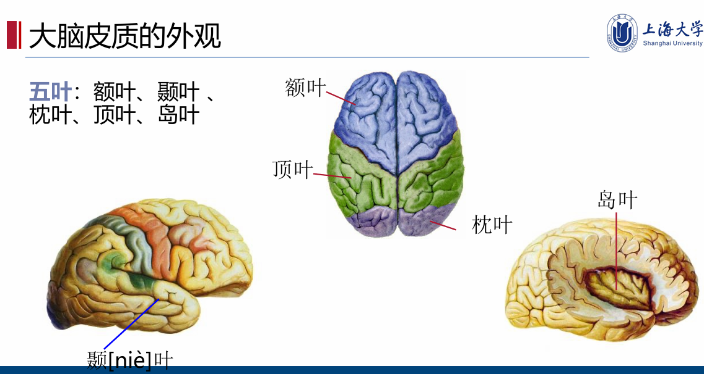
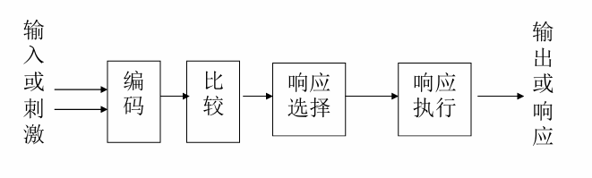
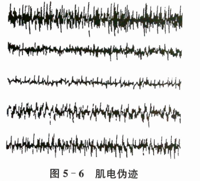
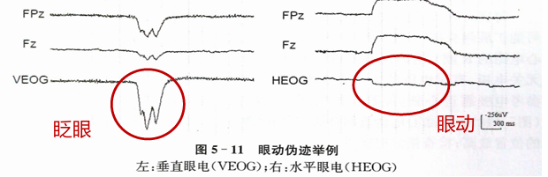
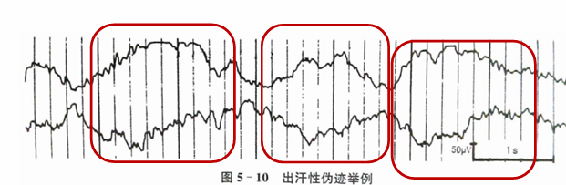
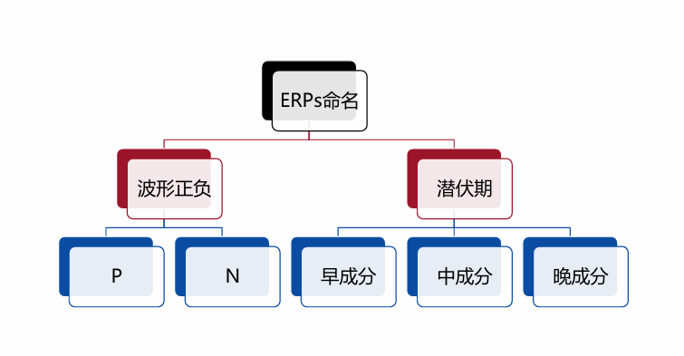
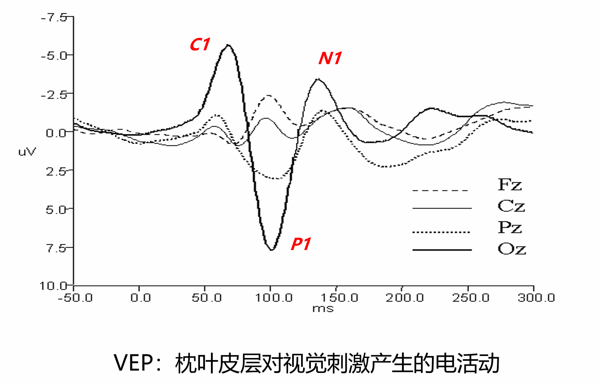
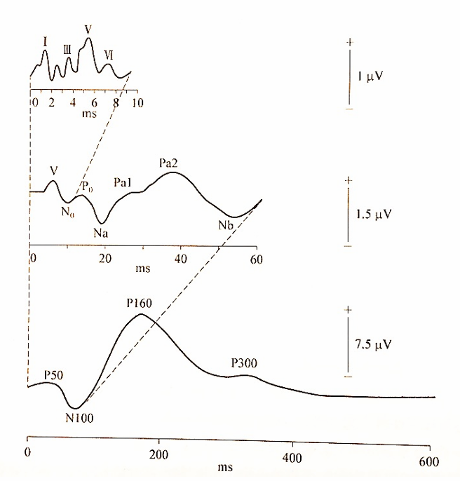
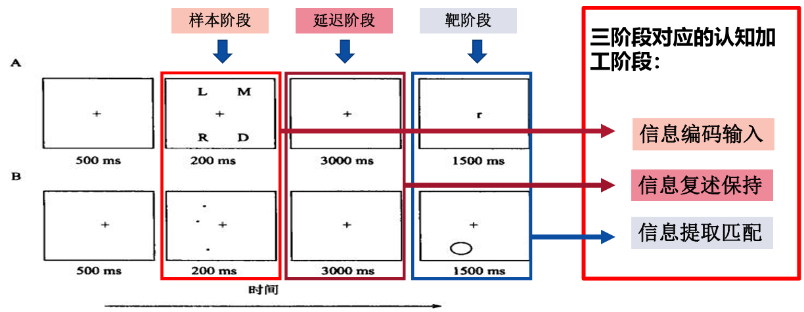

# 人工智能与脑认知
> :heavy_exclamation_mark: 考前预测的重点
> ==xx==考到的部分小题和几乎所有简答题，大题
## Chapter 1 人工智能与脑科学

### 人工智能与智能

#### 史观

- 亚里士多德 三段论 前提真 结论真；培根 归纳法 前提真，结论不一定真
- Godel的这两条定理，指出了把人的思维形式化和机械化的某种**极限**，在理论上证明了**有些事情是做不到的**
- 诺伯特·维纳认为所有人类智力的结果都是一种**反馈**的结果；**反馈机制**是有可能用机器模拟的
- 图灵测试使实验研究智能行为成为可能
#### 相关定义:heavy_exclamation_mark:

##### 人工智能 

1. **基于能力行为的定义**：智能机器所执行的通常与人类智能有关的智能行为 ，如判断、推理、证明、识别、感知、理解、通信、设计、思考、规划、学习和问题求解等思维活动 。
1. **学科的定义**：计算机科学中涉及研究、设计和应用智能机器的一个分支 。它的近期目标在于研究用机器来模仿和执行人脑的某些功能，并开发相关理论和技术。

##### 知识
==人们通过体验、学习或联想而知晓的对客观世界规律性的认识，包括事实、条件、过程、规则、关系和规律等==

##### 智能

两种定义方式：
人类在认识和改造世界的活动中，由脑力劳动表现出来的能力。包括感知、理解、抽象、分析、推理、判断、学习和对变化环境的适应等等。

一种应用知识对一定环境或问题进行**处理**的能力或者进行**抽象思考**的能力。

##### 智能机器
能够在各类环境中**自主地或交互地**执行各种拟人任务的机器。

##### 生物智能
生物智能是个体有目的的行为、合理的思维, 以及有效的适应环境的综合能力
#### 人类思维的主要形态

==**感知，形象，抽象，灵感**==

1. 感知是思维的**初级形态**，来源**客观的，丰富的**
2. 形象思维主要是典型化的方法进行概括，用形象材料来思维，高等生物共有。
3. **形象思维**处理外部感知，进一步进行抽象思维

#### 人工智能的五个基本问题

1. **知识与概念化**是否是人工智能的核心？
2. **认知能力**能否与**载体**分开来研究？ 
3. **认知的轨迹**是否可用**类自然语言**来描述？ 
4. **学习能力**能否与**认知**分开来研究？ 
5. 所有的认知是否有一种**统一的结构**？

#### 人工智能的研究目标
* 根本目标是要求计算机不仅能模拟而且可以延伸、扩展人的智能， 达到甚至超过人类智能的水平。
* 近期目标是使现有的计算机不仅能做一般的数值计算及非数值信息的数据处理，而且能运用知识处理问题，能模拟人类的部分智能行为。
* 作为工程技术学科，人工智能的目标是提出建造人工智能系统的新技术、新方法和新理论，并在此基础上研制出具有智能行为的计算机系统。
* 作为理论研究学科，人工智能的目标是提出能够描述和解释智能行为的概念与理论，为建立人工智能系统提供理论依据。

#### 人工智能分类 :heavy_exclamation_mark:
> 听王昊的意思必考？草结果没考，至少a卷没考

类人思维方法 理性思维系统
类人行为方法 理性行为系统
### 人脑工程 

#### 人类脑计划 
人类脑计划的核心：***神经信息学***，指**神经科学**和**信息科学**相互结合的研究领域。

目标：**认识脑，保护脑，创造脑** :heavy_exclamation_mark:

### 选择题

#### 人脑的特点
1. 大脑重量占人体的2%，能耗却达到正常消耗的20%，是人体能量消耗最大的器官之一。
2. 大脑的神经细胞超过1000亿个，具有一定的自我修复、学习和功能强化能力。
3. 大脑具有计算机所不能达到的逻辑思维、情感思维和模糊分析能力。
4. 脑死亡状态下，脑部**仍产生生物电流**，脑神经元若未完全死亡还有脑电。

#### 人脑的智能特点  :heavy_exclamation_mark:

1. 能感知客观世界的信息 **（感知能力）**

2. 能对通过思维获得的知识进行加工处理 **（记忆与思维能力）**

3. 能通过学习积累知识增长才干和适应环境变化 **（归纳与演绎）**

4. 能对外界的刺激作出反应传递信息 **（学习能力以及行为能力）**

#### 人工智能与人的自然智能 :heavy_exclamation_mark:
1. 人工智能是人类智能的延申与扩展
2. 人的自然智能能够结合外部环境进行合理的判断，而人工智能可以根据外界的输入（即外界环境的变化）进行分析输出，两者具有相似性，但是不具备可替代性。
3. 在所有人工智能的定义以及人工智能的基本问题中，人工智能的目的是为了代替人的某些单调的或是复杂的体力和脑力活动，从而让人具有更多的精力来完成更加复杂的工作。
4. 人工智能技术实质上是一种类人行为和思维方法。

#### 人工智能的描述

1. 人工智能的研究注意智能系统的效果而不是单纯的对人的智能行为的模拟。
2. 人工智能研究者主要从智能行为的过程与表现入手。
3. 人工智能的目标是提出建造人工智能系统的新技术、新方法和新理论，并在此基础上研制出具有智能行为的计算机系统。
4. 人工智能的目标是提出能够描述和解释智能行为的概念与理论，为建立人工智能系统提供理论依据。

## Chapter 2-a 认知科学概述

### 认知神经科学

####  定义

认知神经科学是认知活动的**心理过程**和**脑机制**的科学。

心理学由认知心理学进入到认知神经科学的新时代。认知神经科学并不是认知心理学的分支

#### 研究模式

将**行为、认知过程、脑机制**三者结合起来

#### 常用研究方法

1. **无创性脑功能（认知）成像技术**
- 脑代谢功能成像
- 生理功能成像
2. **清醒动物认知生理心理学研究方法**
- 包括单细胞记录
- 多细胞记录
- 多维（阵列）电极记录法
- 其他生理心理学方法（手术法、冷却法、药物法等）
3. 脑事件相关电位、脑磁图和高分辨率脑成像等生理学电位方法

#### 具体研究方法
- 脑整体活动层次
- 不同脑区活动层次
- 神经细胞和亚细胞层次
- 分子活动层次

#### 认知活动测量工具
脑活动测量工具：
- 脑电波（Electroencephalogram， EEG）
- fNIR近红外光学脑成像系统
- 脑磁共振

其他生理设备：眼动仪、皮电、肌电、血电容积等

#### 神经系统

神经系统分为：**中枢神经系统**和**周围神经系统**

### 认知心理学
#### 核心 :heavy_exclamation_mark:
输入和输出之间发生的内部心理过程
#### 研究对象
1. 人的高级心理过程，主要是认知过程
2. 信息加工心理学

#### 研究内容
1. 人们如何获得外部世界信息
2. 信息在人脑内如何表示并转化为知识
3. 知识怎样存储又如何用来指导人们的注意和行为
4. 从认知神经生理基础、感知觉基本过程、认知行为脑机制到认知心理应 用多个层面探索心智奥秘
5. 从基因-神经-心理-行为层面出发，开展个体-群体-组织-社会等多个水平 的基础研究和应用研究 

### 脑结构与功能
#### 神经细胞的组成

细胞体，轴突，树突

#### 脑的结构

**大脑、间脑、小脑、中脑、脑桥及延髓**等六个部分

#### 大脑皮质

- 三个面：上外侧面、内侧面、下面
- 三个沟：中央沟、外侧沟、顶枕沟
- ==**五个叶：额叶、顶叶、枕叶、颞叶、岛叶** :heavy_exclamation_mark:==
  
大脑皮质中，**额叶**部分负责高级思维相关，**枕叶**部分被认为是视觉初级感受区，**颞叶**主要是听觉初级区域所在的位置。

#### 左右脑
:heavy_exclamation_mark: 左右脑的协同主要依赖**胼胝体** 
> 选填？

##### 对比
左半脑主要具有语言、分析、计算、抽象、逻辑、对时间感觉等思维功能；右半脑具有表象、综合、直观、音乐、对空间知觉和理解等思维功能。在思考方式上，左半球是垂直的、连续的、因果式的；右半球是并行的、发散的、整体式的。

##### 联系
大脑左右半球的分工并不是那么泾渭分明，功能的单侧化只具有相对的意义，左右半球既有相对的分工，又有密切的协作，人的许多重要的心理功能都需要左右半球的密切协作才能完成。

#### 脑的联络区
大脑中除了一些具有特定功能的中枢外，还存在着广泛的脑区，它们不局限于某种功能，而是对各种信息进行加工和整合，完成高级的神经精神活动，称为联络区。

#### 大脑认知功能模块:heavy_exclamation_mark:
**加扎尼加**提出脑认知功能模块论

#### 无法说话 :heavy_exclamation_mark:

原因是**运动型语言中枢**出问题
## Chapter 2-b 认知科学详细
### 认知科学
认知科学是研究人类感知和思维信息处理过程的科学，**(研究方向)** 包括从感觉的输入到复杂问题求解, 从人类个体到人类社会的智能活动, 以及人类智能和机器智能的性质。

#### 研究层次（认知科学or认知神经科学）

分子、细胞、脑组织区和全脑
#### 四个焦点问题 *（可能多选）*

1. 知觉和认知
2. 运动和行为
3. 记忆和学习
4. 语言和思考

#### 认知的三个方面

==***适应、结构、过程***==

#### hoston等对认知的看法

1. 认知是信息的处理过程；
2. 认知是心理上的符号运算；
3. 认知是问题求解；
4. 认知是思维；
5. 认知是一组相关的活动，如知觉、记忆、思维、判断、推理、问题求解、学习、想象、概念形成、语言使用等

#### 认知的分类

**经验认知**和**思维认知**

#### 感知和认知的定义及关系 :heavy_exclamation_mark:
> 感觉得背

感知：即通过人体器官和组织进行人与外部世界的信息的交流和传递

认知：人们在进行日常活动时发生于头脑中的事情，它涉及思维、记忆、学习、幻想、决策、看、读、写和交谈等

关系：感知是认知的基础，认知是将感知获取的信息综合应用

### 感知

#### 种类
视，听，嗅，味，触

#### 视觉

##### 一些性质
- 与外界联系最重要的通道 **80%信息来源**

- 视觉感知的两个阶段：接受信息和解释信息

##### 特点
- 一方面，物理特性决定了人类无法看到一些事物
- 另一方面，解释处理信息时可对不完全的信息发挥一定想象力

##### 视敏度
指**人眼对细节的感知能力**，通常用被辨别物体最小间距所对应的视角的倒数表示。

##### 图像识别
> 只考一题？

两种理论：**模板匹配**和**原型匹配（格式塔心理学）**

###### 格式塔
格式塔即任何分离的整体，认为整体比局部更优先被感知

##### 阅读 :heavy_exclamation_mark:
> 很重要；感觉会考？

三个阶段
1. 页面上文字的形状被人眼感知
2. 文字被编码成相关的内部语言表示
3. 语言在人脑中被解释成有语法和语义的单词或句

##### 颜色模型
> 顶多一道选择题？

- RGB（加性原色系统）
- CMYK（减色原色系统）
- HSV（色调、饱和度、亮度）

#### 信息表示方法
> 小概率？

信息的显示方式对于人们能否快速捕捉到所需的信息片断有很大的影响。**分类显示**的信息就比较便于人们查找

### 识别

:heavy_exclamation_mark:人的***识别能力大于回忆能力***
> 重复过，感觉会考

#### 人脸识别 :heavy_exclamation_mark:

在人脸的感知中，全局特征一般是用来**进行粗略的匹配**，局部特征一般是用来提供更为**精细的确认**

脸部的识别为整体优先，物体的识别为局部优先

##### 对于人脸的识别下面说法正确的是
- 人脸的上半区域的识别的重要性要高于下半区域。

- 个性化特征可以用于更加精确的识别。

- 特殊脸比大众脸型更容易被记住和识别。

#### 记忆
三个环节：**识记，保持，再认和回忆**

#### 交互设计

1. 应考虑用户的记忆能力，勿使用过于复杂的任务执行步骤。
2. 由于用户长于“识别”而短于“回忆”，所以在设计界面时，应使用菜单、图标，且它们的位置应保持一致。
3. 为用户提供多种电子信息（如文件、邮件、图像）的编码方式，并且通过颜色、标志、时间戳、图标等，帮助用户记住它们的存放位置

### 场依存性与场独立性:heavy_exclamation_mark::heavy_exclamation_mark::heavy_exclamation_mark:
> wh说必考，猛猛背 考个鸡脖，a卷无

场依存性的人：

1. 独立性差，并且容易受暗示；比较容易受当时环境中的其它事物（包括知觉者本身的状况）的影响，很难离析出知觉单元。
2. 倾向于以外在参照（客观事物）作为信息加工的依据。

场独立性的人

1. 有较大的独立性，并且不易受暗示；比较少受知觉当时的情境影响，比较易于离析出知觉单元。
2. 倾向于更多地利用内在参照（主体感觉）。

### 认知概念框架
四种框架

1. 思维模型
2. 信息处理模型
3. 外部认知模型
4. 分布式认知模型

### 信息处理模型
> wh提了

## Chapter 3 事件相关电位概述
### 脑活动测量方法 :heavy_exclamation_mark:
- **脑电图（EEG）——时间分辨率最高**
- 脑磁图（MEG）
- 功能性磁共振成像（fMRI）
- **功能性近红外成像（fNIR）——空间分辨率最高**
- 正电子发射断层扫描（PET）
- 功能性经颅多普勒超声（fTCD）

### 脑神经活动特点及脑电产生原理
脑电首次发现**贝鲁加**
>wh提到了

#### 脑的工作原理
人的感觉、情感、动作、包括不能意识和控制得体内活动都是由**电化学、生物活动**左右

##### 突触结构
突触的结构包括**突触前膜（突触小泡）、突触间隙、突触后膜（受体）**

#### 脑电（EEG）产生原理

1. 活的人脑一直会不断放电，产生脑电波
2. 是由大脑大量的神经组织的活动产生的
3. 是由皮质中的神经组织突触后点位同步总和而成的

#### 脑电测量的基准 :heavy_exclamation_mark:

CZ
##### 电极名称
Fp=额极（frontal pole）;
F=额（frontal）；
C=中央（central）；
P=顶（parietal）；
O=枕（occipital）
T=颞（temporal）
#### 脑电节律

1. alpha波：8-13Hz
2. beta波：13-30Hz
3. Theta波：4-8Hz
4. Delta波：0.5-4Hz

### 事件相关电位（ERP）的概念及特点 :heavy_exclamation_mark:
>大概率会考
#### ERP的定义 :heavy_exclamation_mark::heavy_exclamation_mark:

事件相关电位是由外加的一种**特定刺激**，作用于**感觉系统**或**脑**的某一部位，再**给予**刺激或**撤销**刺激时，在脑区所引起的**电位**变化。被认为是**心理行为**的一种客观表现形式。

#### ERP的特点

1. **潜伏期恒定**
2. **波形恒定**

#### ERP的优点和缺点
优点：
1. 优异的时间分辨率
2. 推断受实验调控影响的认知过程
3. 识别多个认知神经过程
4. 认知过程的内隐性测量
5. 可以作为一些医疗应用的生物标志物

缺点：
1. 仅仅是脑活动的外在反应，无法提供实际的脑活动机制（这在大部分的测量系统里都存在）；
2. 代表了许多潜在成分的总和（即为多个成分的叠加），**无法判断这些潜在成分的神经元活动位置；**
3. 有些心理或神经过程可能并不存在对应的ERP。必须满足特殊的生物物理学条件时，ERP才是可记录的；
4. ERP相对噪声水平来说时很小的，需要多次测量才能够得到；噪声产生的来源非常广泛；
5. 时间跨度不能特别长

#### 相较于其他生理测量手段
1. 无创伤性，但是干扰明显。
2. 时间分辨率高（ms级），但是空间分辨率不足（大脑表层）；
3. 价格便宜

#### ERP的起源
##### 神经元细胞的主要电活动

- 动作电位
- 突触后电位

**ERP 几乎都是起源于突触后电位**
**仅有小部分的大脑活动能够引发头皮表面的ERPs**

1. 头皮上的ERP通常并不是由动作电位引发的（除刺激后几十毫秒内出现的听觉响应外）。
2. 数以千计的且有类似朝向的神经元引发的电偶极子相互叠加时，才能够在头皮表面观察到。
3. 头皮上记录到的ERPs几乎总是反应了锥体细胞（皮层中主要的输入-输出细胞）的神经传导。

##### ERP为什么总是反应了锥体细胞的神经传导？ :heavy_exclamation_mark::heavy_exclamation_mark: 
锥体细胞是皮层中主要的输入-输出细胞，它们的朝向与皮层表面垂直，所以他们的偶极子会相互叠加，而不是抵消。

#### 影响ERPs成分的极性的因素

四个因素

- 突触后电位是兴奋性还是抑制性
- 突触后电位是发生于尖端树突，还是发生于基底树突和细胞体；
- 所形成的偶极子相对于活动记录电极的位置朝向；
- 参考电极的位置

#### 获取ERP的生理条件

- 大量神经元必须同时活动；
- 神经元个体之间必修具有大致相同的朝向；
- 大部分神经元中的突触后电位必须来自于神经元中的同一部位（尖端树突或者细胞体和基底树突）
- 大部分神经元必须具有相同的电流方向，以避免相互抵消

#### ERPs数据获取
获取到的ERP数据是给定电极的电压和频率所有的潜在成分的**加权总和**，但是，人们感兴趣的是**单个成分**。
##### ICA:heavy_exclamation_mark::heavy_exclamation_mark::heavy_exclamation_mark:
>wh说必考

独立成分分析（Independent Component Analysis，简称ICA）是一种用于多维信号分离的统计方法，旨在将多个混合信号分解为独立的成分。

==**目的**:==
1. ==从混合信号中提取出各独立的信号分量。==
2. ==滤除伪迹。==

### 脑电特征

#### 脑电基线
每一个波上下偏移时都会依据自己的中心点，将连续脑电波的每一个中心点连接起来，就会成为一个近似的直线，该线被称为基线。

基线平稳：中心轴线为一条直线或近似直线
基线不平稳：若形成一条波幅高于25μV，时间大于1000ms缓慢移动的曲线
基线欠稳：波幅小于25μV。则成为基线欠稳

##### 基线矫正的目的 :heavy_exclamation_mark:
消除由于时间或其他外部因素造成的信号偏移，从而使信号能够准确地反映实际的情况。

==根据时间的不一样，脑电的活动不一样，脑电波形是有偏移的，这是一个外部问题，所以要将它从偏移上拉下来，做一个近似直线。这样才能很好的观察到波形的存在==
> 考的基线移除？反正不会随便写上去了
#### 伪迹
生物伪迹
- 眼伪迹
- 心电伪迹
- 肌电伪迹
- 舌动伪迹
- 皮点伪迹

##### 几种伪迹图 :heavy_exclamation_mark:
> 分辨伪迹

## Chapter 4 ERP成分
### 概述
#### ERP的成分的定义
1. 概念性的定义：一个ERP的成分是当大脑执行某个特定的计算信号时，产生于某个特定的神经解剖学模块，并且可以在头皮上记录到的神经信号。**（ERP的本质）**
2. 实用性的定义：一个成分为一些电位的变化，它们符合单一的神经产生源位置，并且在不同的实验条件、时间段、个体等等之间出现系统性的变化。
**即：一个ERP成分是一个ERP数据集内具有系统性和稳定性的变异源。**
3. 习惯性的定义：如果结构简单、且对应与一个单偶极子（或者一对在左右半球间呈镜像堆成的偶极子）相符，我们可以暂且认为它是个单一成分。

#### ERP成分分类
ERP有多种分类，主要的有根据**刺激成分、感觉通路及潜伏期**三种分类方法

##### 根据潜伏期分类
- 早
- 中
- 晚成
- 慢波

##### 根据刺激成分分类
- 由刺激呈现而强制性诱发的**外源性感官成分**
- 完全反应任务相关神经过程的**内源性成分**
- 伴随运动准备和执行过程的**运动成分**

##### 根据感觉通路分类
- 听觉诱发电位
- 视觉诱发电位
- 体感诱发电位

#### ==ERP成分解释时避免歧义的方法==

>一道多选题

1. **聚焦于单个成分**；一个实验仅仅关注一个或两个ERP成分，尽量使其他所有成分在不同的条件之间保持不变。
2. **聚焦于较大的成分**；当感兴趣的成分远大于其它成分时，它在观测波形中占据主导，此时对该成分的测量，相对来说不太容易受到来自其它成份的干扰。
3. **从其它领域中劫持有用的成分**；利用与实验主题本不明显相关的成分来进行解释。
4. **采用经过充分研究的实验操作**；考察一个已被研究过的ERP成分，且尽可能保持实验条件与先前该成分研究时的条件类似。
5. **利用差异波**；差异波有助于分离特定的ERP成分，但是解释的时候需要小心。这也是目前应用的越来越多的方法。
6. **聚焦容易分离的成分**；利用某个成分研究其之前发生的加工过程，不同条件之间出现的差异在逻辑上意味着某些过程已经发生了。
7. **利用某个成分研究其之前发生的加工过程**；不同条件之间出现的差异在逻辑上意味着某些过程已经发生了。
8. **与成分无关的实验设计**；利用许多已有策略都聚焦于可以分离出特定的ERP成分，完全回避这些特定成分的识别问题，也能够有效的解释需要注意的成分。

### 听觉和视觉诱发电位 :heavy_exclamation_mark::heavy_exclamation_mark:

>wh说视觉，听觉必考一个
#### 视觉诱发电位（VEP）:heavy_exclamation_mark::heavy_exclamation_mark:

:heavy_exclamation_mark: **研究枕叶皮层对视觉刺激产生的电活动** 
##### C1成分 :heavy_exclamation_mark:
> 比较重要 

1. 通常发生在P1之前（不一定会出现）；
2. 在头皮后部中线处的电极上；
3. 下视野的刺激诱发的C1为正性，上视野的刺激诱发的是负性。

***C1的产生极性出现不同的原因是什么？***
在实验中，如果诱发的成分产生区域为距状裂上方的区域，由于其负责编码下方的视野，则产生的为正性。如果刺激诱发的是距状裂下方的区域，由于其负责编码上方的视野，则产生的C1为负性。

##### P1 成分 :heavy_exclamation_mark:
> 比较重要

***特性***
1. 第一个主要的视觉成分；
2. 通常起始于刺激后60-90ms，并于100-300ms达到峰值；
3. **潜伏期受刺激对比度**的影响非常大；
4. 对**刺激参数敏感**，受**选择性注意**和受试者**觉醒状态控制**；
5. 振幅对于刺激是否与任务下的**靶刺激类别匹配不敏感**

***位置***
- 最大幅值位于侧向枕叶电极；
- **早期成分产生于背侧纹外皮层，晚期成分产生于梭状回的腹侧部分**

##### N1 成分 :heavy_exclamation_mark:
> 比较重要

**N1对注意力敏感** 

1. 紧随在P1后面；
2. 包含多个子成分;
   - 这些子成分在功能上不一定关联，被称为子成分的原因是因为它们共同构成了波形中的一个显著偏转。
   - 最早的子成分峰值出现在刺激后100-150ms，位于前部头皮电极位置；
   - 在后部电极位置，至少有2个N1成分的峰值出现在刺激后150-200ms，一个来自顶叶皮层，另一个来自外侧枕叶皮层；
3.  具有高度的不应性;如果短时间内接连出现两个刺激，那么第二个刺激诱发的响应会减少许多

##### P2 成分 （我赌它不考）
#### ==听觉诱发电位（AEP） :heavy_exclamation_mark::heavy_exclamation_mark:==
> 背吧感觉会考，果然考了，明年感觉还会考

 
这是一个简单听觉（嘀嗒声）诱发的脑电。
0-10ms： 体现了来自耳蜗的信息经过脑干传递到丘脑的过程；这些听觉脑干响应，通常用罗马数字进行标记。  这些响应是高度自动的，可以用来评估听觉通道的完整性。

10-50ms：中潜伏期响应，至少部分来自内次膝状体和初级听觉皮层。注意力对该部分有调控作用。

50ms-：长潜伏期响应。（通常顺序为P50（P1），N100（N1）和P160（P2））这个潜伏期比高级认知成分低，但从听觉器官的特性来说，100ms相对比较晚了。受到高级认知的影响，如注意力、觉醒度等。

### 主要成分 :heavy_exclamation_mark::heavy_exclamation_mark:

#### 关联性负变（CNV）
**标志着现代ERP研究的正式开始**
> 考了一道填空
> 说不定明年就考到上面这句话了
> 
==CNV被认为主要与***心理因素***有关。比如期待、意动、朝向反应、觉醒、注意、动机等，可以认为它基本上是一个**综合**的心理准备状态的反映，处于**紧张或应急状态**的反映。==

#### N2
N2a是一个由听觉刺激匹配条件自动诱发的效应，甚至当刺激与任务无关的时候也会被诱发。这一效应通常被称为**失匹配负波**（mismatch negativity,MMN）

#### 失匹配负波（MMN）
产生于**额叶和颞叶**

由于MMN具有**高度的自动性**，对于无法容易做出行为反应的人群进行研究就会非常有用：如不会说话的婴儿、处于昏迷状态的人

##### 差异波
**目的**：是去除相同的内容，得到较为纯粹的成分
**前提**：两种条件的心理活动或者机制的差异是清楚的，不包含其他成分

#### N2pc
“N”——负波，“2”——200ms左右出现，“pc”——posterior contralateral，即对侧脑后区域。

N2pc 是一种与**空间选择性注意**密切相关的ERP 成分, 反映了对当前任务相关刺激所进行的空间选择加工
##### N2pc相关结论
1. N2pc对研究注意是否已被隐性的转移至特定物体，以及注意转移的时间过程时非常有用；
2. N2pc能够被用来判断注意是否会自动地被明显但无关的物体所捕获；
3. N2pc可以证明被遮掩的阈下物体仍然能够吸引注意。
4. 与奖赏有关的物体可以诱发更快的注意转移；
5. 注意力在某些视觉搜索任务下是以串行方式在物体间转移的；
6. 精神分裂症患者在某些条件下的注意转约速度和正常人一样快。

##### N2pc产生区域
- 视觉皮层V4区
- 外侧枕叶皮层复合体位置

#### P300
##### P300的特点 :heavy_exclamation_mark::heavy_exclamation_mark:
**振幅**：P300波幅与概率成**反比**，靶与非靶皆然
**潜伏期**：P300的潜伏期随任务**难度的增加而增加**
判断同义词的任务较难，潜伏期较长

#### N400
##### 诱发N400
- 阅读中的歧义信息
- 特殊的图片特征
- 面孔识别
## Chapter 5 实验范式
典型范式
- Oddball范式
- Go-Nogo范式
- 特定认知领域实验研究范式

### 靶刺激
- 靶刺激是需要被测做出反应的⽬标刺激；
- 在Oddball实验中，通常将偏差刺激作为靶刺激。
- 根据实验需求，靶刺激可以是偏差刺激，也可以是新异刺激。

### Oddball实验范式

==经典Oddball范式也被称为**基于概率的实验范式**，是在一项实验中随机呈现**同一种感觉通道**的两种刺激，两种刺激的概率相差很大，大概率者即经常出现者称为**标准刺激**，小概率者即偶然出现者称为**偏差刺激**。==
> 典，我赌明年继续考
> 
将**偏差刺激作为靶刺激**

***可用来获取P300成分，MMN成分***

### Go-Nogo实验范式

#### 与Oddball范式的区别
- 取消标准刺激与偏差刺激之间的概率差别；
- 需要被试者反应的刺激为Go刺激，不需要反应的为Nogo刺激。

### 知觉和意识研究的实验范式

#### 视觉的局部优先与整体优先 :heavy_exclamation_mark:
> 一道填空题
> 
==物体认知：局部优先，物体的识别常常被表征为各部件的外形==

==脸部认知：整体优先，脸部常常被表征为一个整体==

#### 视运动知觉启动范式

##### 理论基础
>草 多选改大题，md没背下来
1. ==视觉感知是可以被诱导的（或者被启动的）；==
2. ==视觉运动知觉的启动是一种非意识加工的脑机制；==

##### 相关论述
1. ==某一特定运动方向的视觉刺激，即使是非意识的也能使视觉运动知觉偏向它们的方向。==
2. ==视运动知觉启动可以提供一种非意识加工脑机制的研究方向。==

### 视觉注意研究的实验范式（空间注意提示范式）
> wh和题目都只有空间注意提示范式，前面的早期实验就没管了

:heavy_exclamation_mark:在经典视觉注意实验中，当有效刺激诱发的 **P1** 和 **N1** 成分比无效、中性刺激诱发的明显增大。
#### 概述 :heavy_exclamation_mark:

##### 基本范式 
注视点 —— 提示 —— 靶

##### 特点
1. 搜索时的心理活动主要是注意的选择；
2. 搜索到靶后对靶的属性进行分辨，分辨过程的心理活动中含有注意的集中；
3. 可以改变提示信息的有效性、提示与靶的间隔、提示范围大小等来研究各种视觉空间注意的脑机制。

#### 有效提示与无效提示
提示的有效与无效，指的是提示信息对指定的任务所起到的作用真实与否，即**提示信息能否正确反应靶刺激的情况**。

#### 符号性提示又称内源性提示
#### 周围提示
更容易诱发 **P1**和**N1**

#### 提示与靶的间隔

##### 注意的分类
- 随意注意
- 非随意注意

##### 提示与靶的间隔对注意的影响

**原因**：随意注意和非随意注意的***来源、性质、功能以及脑内加工的机制不同***

- 随意注意：又被称为内源性注意，提示与靶的间隔长（大于500ms）、提示有效率高（大于70%）
- 非随意注意：又被称为外源性注意，提示与靶的间隔短（小于300ms）、提示有效率低（小于50%）

#### 上、下视野提示

下视野为优势视野

#### 结论
- 三种刺激诱发的N2pc在潜伏期和头皮分布上相同；
- 运动靶的N2pc虽然稍大，但系运动靶会比颜色靶、方向靶自动吸引更多注意资源所致；
- **颜色、方向与运动的搜索动用的是同一个注意系统。**

### 记忆研究的实验范式

#### 工作记忆实验范式 :heavy_exclamation_mark::heavy_exclamation_mark:

##### 工作记忆分类 :heavy_exclamation_mark:
*三个子系统*

- 中央执行系统
- 语音回路
- 视觉空间存储

##### ==认知加工的三个阶段==
> 听wh说的感觉会考，考了 

使用**样本延迟匹配**范式（任务）对其进行研究

- ==样本阶段 —— 信息编码输入==
- ==延迟阶段 —— 信息复述保持==
- ==靶阶段 —— 信息提取匹配==

##### n-back任务

n-back任务是让被试浏览一系列逐个呈现的项目，然后要求被试从第n个项目起判断每一个出现的项目是否与前面刚呈现过的倒数第n个项目匹配。

***特点：能够通过控制n的大小来操纵工作记忆的负荷，从而考察不同记忆负荷下工作记忆的加工机制***

#### 学习——再认实验范式
> wh说没怎么考，考了个多选

**发现的新效应**
- ==相继记忆效应==
- ==重复效应==
- ==新旧效应==
- ==内隐记忆效应==

#### 语言文字研究的实验范式（N400）
其重要意义不仅在于发现了N400的成分，主要是它成功的将**ERP**运用到了**语言心理学**中
##### 研究N400的实验
- 句尾畸义词，N400经典范式；
- 相关词与无关词，词性不同、反义词、无关词产生明显的N400；**近义词不产生**
- 新词与旧词，首次出现的新词与重复出现的旧词，新词可以诱发更正的N400；
- 文字与非文字符号；
- 图片命名，图片内容和名称的匹配

##### 哪些刺激诱发N400
- 阅读中的歧义信息。
- 特殊的图片特征
- 面孔识别

### 情绪与认知相互关系研究的实验范式

#### 需要注意的因素

1. 情绪的快速可变性
2. 影响情绪的因素很多
3. 情绪往往具有延迟性，会影响到我们设计的实验中情绪的测量。
   
#### 一些结论
- 一个人的情绪能够被外来的图片刺激、声音刺激、气味等所感染，诱发**杏仁核**的活动
- 然情绪能够被**外界**所诱发，但是从心理学、生理学角度来说，情绪是一种**无意识**的诱发。
- 情绪活动常伴随一系列生理活动的变化，通过**自主神经系统**和**内分泌系统活动**的改变引起的
- 研究发现，焦虑情绪会选择性的**干扰空间工作记忆任务**，但**未影响词语工作记忆**，因此，情绪对认知的影响**不是全脑水平的**，其交互作用更为复杂。

#### 无意识诱发

本能的防御反应：发怒，恐惧，逃避

## Chapter 6 脑机接口与fNIRs
### 脑机接口
#### 定义
脑机接口是在人或动物脑（或者脑细胞的培养物）与外部设备间建立的直接连接通路。

#### 信号采集方法
脑机接口用到的信号采集方法有侵入式、半侵入式和脑外（非侵入式）。

#### 研究方向
- 人机互交
- 心理认知学  
- 心理疾病评估
- 神经疾病诊断与康复
  
#### 过程
> 作业题有，wh也提了
>
>
脑机接口技术中，使用**信号分析与特征提取方法**，在预处理过程过，将EEG信号分为**5个有用的频带部分**，作为**模式识别**的特征。

#### ==为什么现在很多BCI（脑机接口）的研究都无法做到直接用大脑控制机器人，必须借助于外界的刺激？==

> 考了，但我没背的很详细，小寄
> 
因为大脑的思维或反应在相关的（或不相关的）加工过程中涉及到的多个脑分区，很难通过自发的方式产生高度单一的成分，因此也很难从ERP实验中分离出高度特异的心理或神经过程。目前，借助外界的刺激，可以加强（增强）某一类ERP响应成分，从而达到控制机器人的目的。
### fNIRs

#### 原理

FNIRs成像主要测量大脑活动中，**血氧**的浓度变化

#### ==对比EEG==

> 一道大题

fNIRS

优点：
- 安全、非侵入性
- 造价相对便宜，维护成本低
- 时间、空间分辨率相对较高
- 被尝试友好度高
- 生态效率高
- 兼容性高

缺点：
- 外皮层记录 
- 被试间脑区解剖位置差异
- 信噪比较低

EEG

优点：

- 时间分辨率极高：EEG的时间分辨率非常高，能够捕捉到快速的脑电活动变化。

- 成本相对较低：相对于fNIRS，EEG的设备和维护成本更低。

- 广泛的临床应用：EEG在临床诊断（如癫痫）中有着长期而广泛的应用。

- 便于重复测量：EEG设备相对轻便，便于进行长时间或重复的测量。

缺点：

- 空间分辨率低：EEG的空间分辨率较低，难以精确确定脑活动的具体位置。

- 信号可能受到伪影的干扰：头发、肌肉活动、眼动等都可能对EEG信号产生干扰。

- 实验设置和电极放置要求严格：EEG需要精确的电极放置和常常较长的准备时间。

## Chapter 7 眼动
> 压根没考

### 常用指标

- 访问时长
- 首次注视时间
- 访问次数
- 访问百分比

**眼跳潜伏期：** 刺激呈现到第一个眼跳开始的时间。潜伏期越短，表明当前目标的加工越简单。

